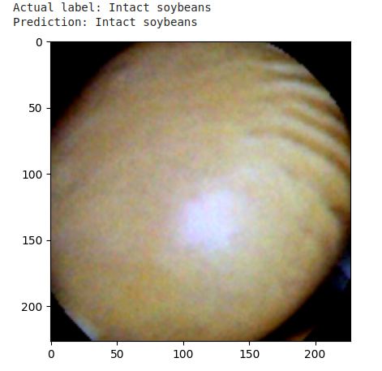
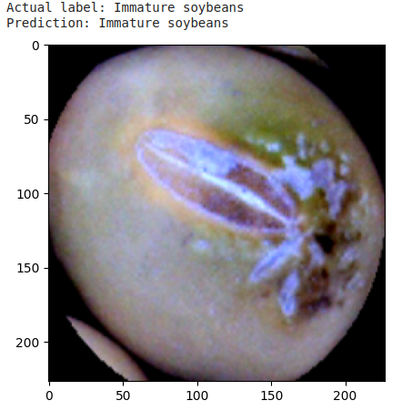
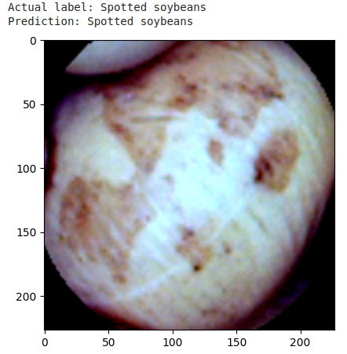
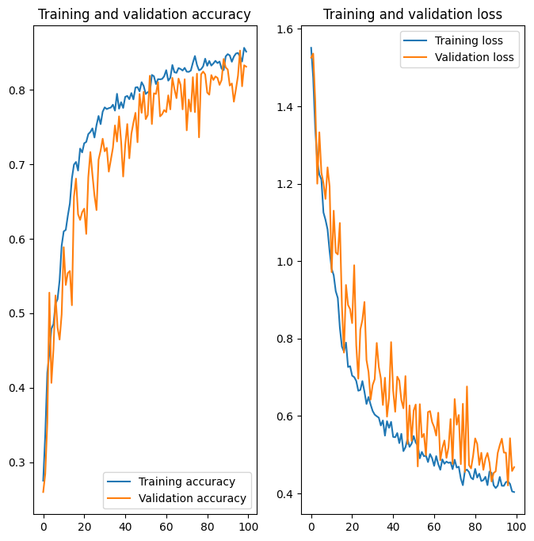
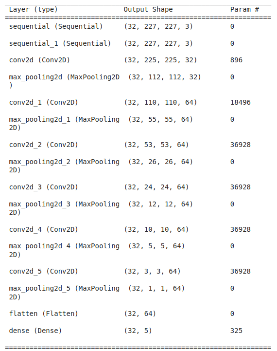

# Inteligência artificial na identificação da qualidade das sementes de soja

A produtividade das lavouras de soja está intimamente relacionada com a qualidade das sementes dessa planta. Segundo um estudo publicado há alguns anos (França Neto et al., 2012), pés de soja oriundos de sementes de alta qualidade tentem a ter uma produtividade cerca de 10% maior do que as plantas obtidas com sementes de baixa qualidade. Logo adquirir lotes de grãos considerados ótimos ou excelentes pode ser algo economicamente lucrativo. Tendo em vista que o mercado de alimentos está cada vez mais competitivo (Pequenas Empresas & Grandes Negócios, 2017), investir em tecnologias que melhoram a eficiência dos processos produtivos é fundamental para as empresas crescerem.

Há diversas técnicas usadas para determinar o estado e a variedade das sementes de soja. Contudo as mais tradicionais e confiáveis são demoradas e acabam por destruir o objeto analisado. Pode-se citar por exemplo a espectrometria de massa e cromatografia líquida de alta performance (Yanlin Wei et al., 2020). Nota-se assim a necessidade de ter um método de diagnóstico da qualidade das sementes que seja rápido, preciso e não destrutivo.

A solução encontrada para o problema foi desenvolver uma rede neural convolucional capaz de classificar imagens de sementes de soja em cinco categorias: quebrada, imatura, intacta, rachada e manchada. Nos testes realizados o modelo chegou a uma taxa de acerto de aproximadamente 85%, um valor muito bom tendo em vista que foi treinado numa base de dados pequena - cerca de 5500 fotografias. Adiante será explicado com mais detalhes como essa inteligência artificial funciona e como ela foi construída.
 
 
<figure>
  
  <figcaption><i>Grão intacto classificado como intacto</i></figcaption>
</figure>
 
 
 
 
<figure>
  
  <figcaption><i>Grão imaturo classificado como imaturo</i></figcaption>
</figure>
 
 
 
 
<figure>
  
  <figcaption><i>Grão manchado classificado como manchado</i></figcaption>
</figure>
 
 
As redes neurais convolucionais (CNN - Convolutional Neural Networks) são uma classe de algoritmos de Aprendizado Profundo (Deep Learning) que vem sendo utilizada com bastante sucesso em aplicações relacionadas com reconhecimento e classificação de imagens¹. Nesse trabalho buscou-se referências acadêmicas do uso da CNN na detecção de doenças em plantas. Muitos artigos foram encontrados principamente aqueles que discutiam classificação de doenças baseado em fotografias de folhas. Após estudar um pouco percebeu-se que essas soluções poderiam ser adaptadas e utilizadas também no reconhecimento e categorização de grãos.


Posteriormente foi encontrado a base de dados Soybean Seeds Classification Dataset², que contém milhares de imagens de grãos de soja separadas em cinco categorias. A solução proposta é a construção de um modelo de aprendizado profundo que aprende através desses dados e, consequentemente, é capaz de classificar imagens de grãos de soja em: quebrado, imaturo, intacto, rachado e manchado.

Utilizou-se o ambiente Google Colab conectado a uma GPU T4 para treinar o software. Uma rotina em Python que usou vários recursos da biblioteca Tensorflow foi escrita a fim de se chegar ao objetivo final. Após vários testes de tentativa e erro, encontrou-se os parâmetros corretos para se obter uma solução eficiente, isto é, com taxa de erro tolerável e sem problemas de underfitting ou overfitting.

Como foi dito anteriormente, a precisão da rotina gira em torno de 85% para um processo de treino de 100 epochs. Foi constatado que aumentar a quantidade de epochs não faz com que as curvas training e validation loss diminuam ainda mais. Ao contrário o gráfico de validation loss tende a aumentar muito mostrando assim um modelo com overfitting. Mesmo após aplicar técnicas de Data Augmentation, Dropout e Batch Normalization com o intuito de aumentar o tempo de treino, por exemplo 150 epochs, o modelo não teve ganhos significativos de precisão. Então optou-se por deixar o software em sua versão mais simples.
 
 
<figure>
  
  <figcaption><i>Evolução da precisão e taxa de erro do modelo ao longo do seu treinamento</i></figcaption>
</figure>
 
 
 
 
<figure>
  
  <figcaption><i>Camadas do modelo</i></figcaption>
</figure>
 
 
Depois do treino o modelo com a maior precisão na base de dados de validação foi salvo num arquivo H5. Apesar de ser possível testar e verificar a solução criada pelo próprio Google Colab (ver as primeiras três imagens), exportar o modelo é fundamental para utilizá-lo em alguma aplicação prática. Uma das ferramentas que podem ser construídas é a consulta por uma parte externa, por exemplo um aplicativo de celular. Nesse caso o arquivo com extensão H5 estaria armazenado num servidor e receberia imagens enviadas do smartphone do usuário via aplicativo. O software analizaria a fotografia e retornaria a classificação mais provavél, que seria exibida na tela do aparelho. Essa aplicação poderia ser utilizada por agrônomos, agricultores e outros profissionais a fim de identificarem os melhores grãos ou determinar a qualidade de um lote com base numa amostra, seja de sementes para plantio ou como matéria-prima para unidades produtoras de alimento.

## Conclusão
As redes neurais convolucionais são uma importante ferramenta na automação do processo de classificação e reconhecimento de imagens. Essa técnica de Deep Learning pode ser empregada em vários setores, dentre eles a agricultura. O aumento da produtividade das lavouras, bem como o rendimento dos processos da indústria alimentícia, é fundamental para um mundo cada vez mais populoso. Atualmente (julho de 2023) há pouco mais de 8 bilhões de pessoas e a expectativa é chegar a quase 10 bilhões em 2050³.

Assim alimentar todos é um desafio muito complexo, principalmente em países em desenvolvimento. Segundo estimativas da Organização das Nações Unidas (ONU), a quantidade de pessoas em situação de fome chegou a 282 milhões em 2020 apenas no continente africano (a região do globo que mais sofre com esse problema)⁴. Logo é imprescindível construir processos de produção de alimentos que extraiam o máximo possível das terras já cultivadas, mas de forma economicamente viável e ambientalmente sustentável.

A inteligência artificial tem se mostrado muito útil na resolução de problemas do mundo conteporâneo. Ela torna processos mais eficientes, reduz custos, aumenta a produtividade e melhora a qualidade de vida. Essa técnica, aliada a outras, tem potencial para construir uma agricultura capaz de resolver o problema da fome e tornar as empresas do setor mais competitivas e lucrativas, gerando assim ganhos para toda a sociedade.

## Referências

França Neto, J. B.; Krzyzanowski, F. C.; Henning, A. A. **Plantas de alto desempenho e a produtividade da soja**. Seed News, v.16, p.8-11, 2012.

Pequenas Empresas & Grandes Negócios. **Alta concorrência no setor da alimentação faz inovação ser essencial para empresário do setor**, 2017. Disponível em: <https://revistapegn.globo.com/Administracao-de-empresas/noticia/2017/10/alta-concorrencia-no-setor-da-alimentacao-faz-inovacao-ser-essencial-para-empresario-do-setor.html>.

Wei Y, Li X, Pan X, Li L. **Nondestructive Classification of Soybean Seed Varieties by Hyperspectral Imaging and Ensemble Machine Learning Algorithms**. Sensors. 2020; 20(23):6980.

1 - MathWorks. **What Is a Convolutional Neural Network?** Disponível em: <https://www.mathworks.com/discovery/convolutional-neural-network-matlab.html>

2 - Lin, Wei; Fu, Youhao; Xu, Peiquan; Liu, Shuo; Ma, Daoyi; Jiang, Zitian; zang, siyang; Yao, Heyang; Su, Qin (2023). **Soybean Seeds Classification Dataset**. Disponível em: <https://www.kaggle.com/datasets/aryashah2k/soybean-seedsclassification-dataset>

3 - PRB. **How Many People Have Ever Lived on Earth?** Disponível em: <https://www.prb.org/articles/how-many-people-have-ever-lived-on-earth/>

4 - Fuentes-Nieva, Ricardo. United Nations - Africa Renewal. **Growing hunger, high food prices in Africa don’t have to become worse tragedy**. Disponível em <https://www.un.org/africarenewal/magazine/may-2022/growing-hunger-high-food-prices-africa-dont-have-become-worse-tragedy#:~:text=Africa%20has%20been%20particularly%20vulnerable,people%20became%20hungry%20in%20Africa.>
